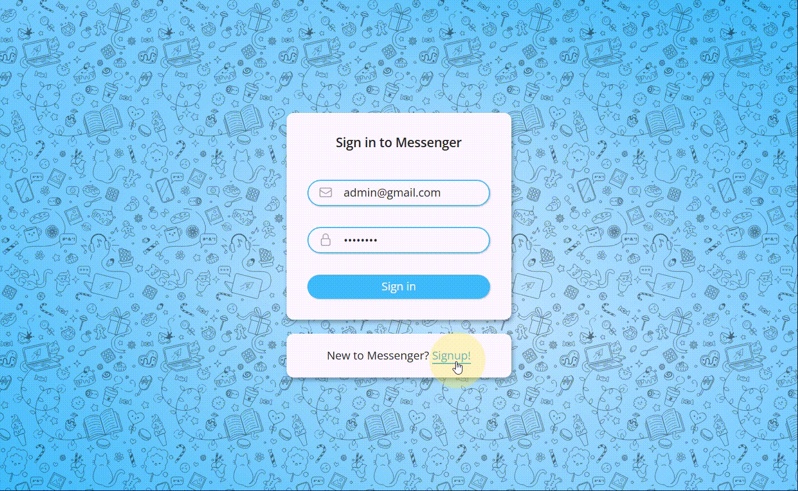
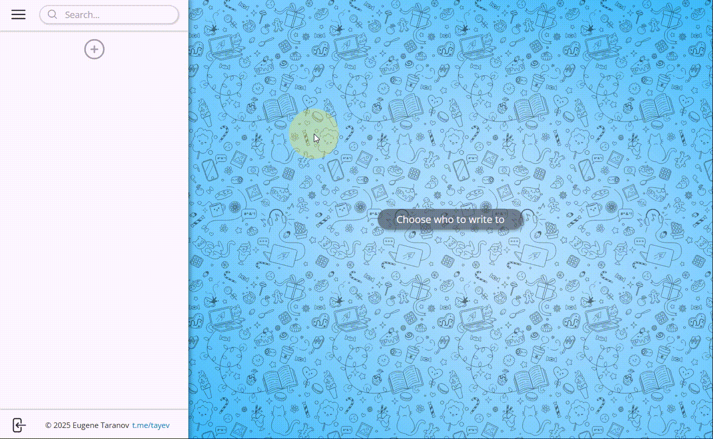
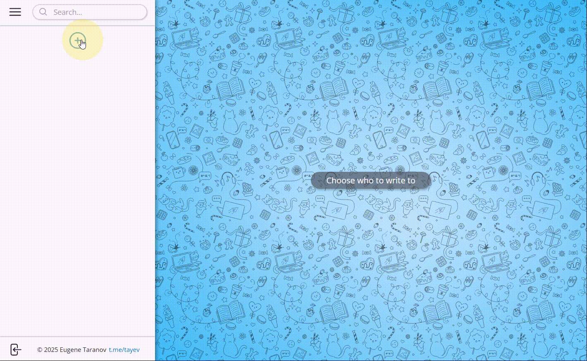
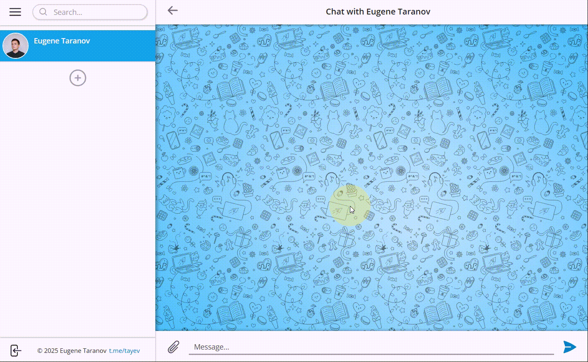
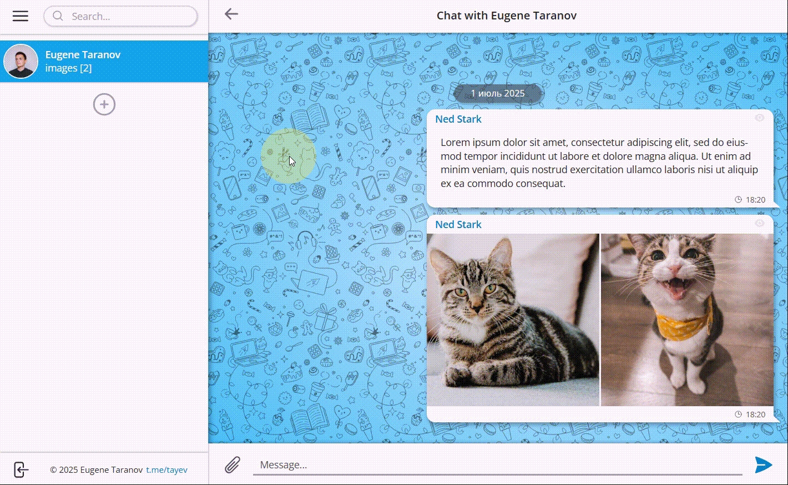
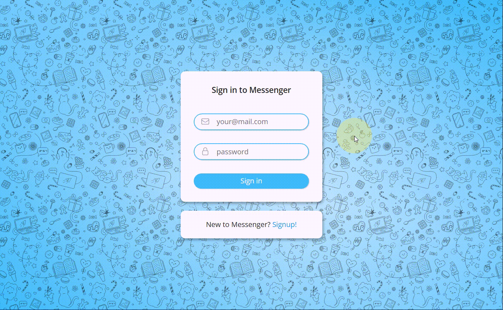
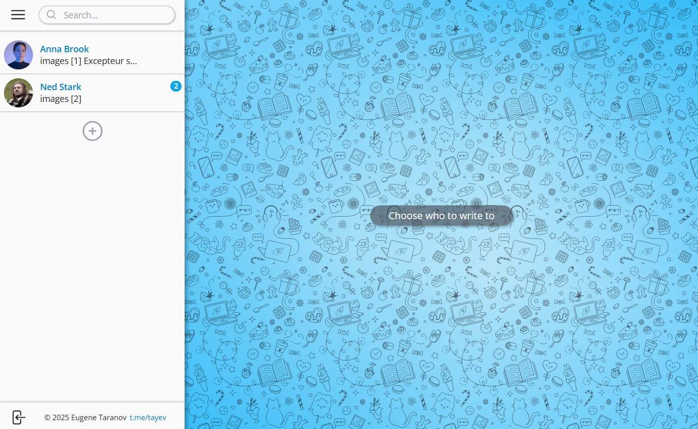
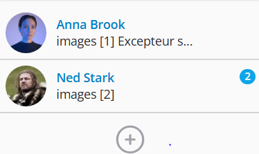
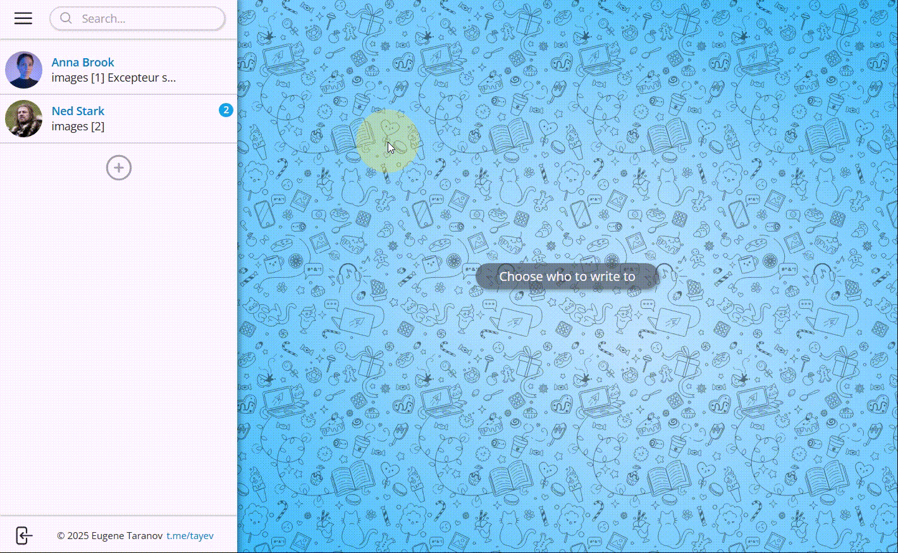
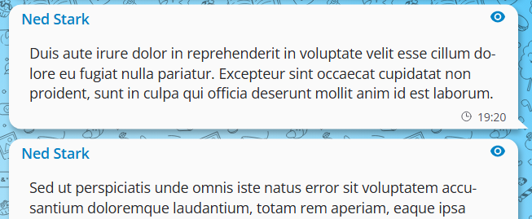

# Messenger App

## Table of Contents

- [Messenger App](#messenger-app)
  - [Table of Contents](#table-of-contents)
  - [About the Project](#about-the-project)
    - [Project Goals](#project-goals)
    - [Technologies](#technologies)
    - [Project structure](#project-structure)
      - [Client](#client)
      - [Server](#server)
    - [Examples of the Application (GIFs and Screenshots)](#examples-of-the-application-gifs-and-screenshots)
  - [Installation](#installation)
    - [Client](#client-1)
    - [Server](#server-1)
  - [Usage](#usage)
    - [Start the server](#start-the-server)
    - [Client](#client-2)

## About the Project

Messenger is a messaging application that allows users to discover new people, exchange text messages, and attach photos to their messages.

This project is my first attempt at applying the Feature-Sliced Design (FSD) architecture.

### Project Goals

- Strengthen my experience building applications with several of the most popular React libraries.
- Gain experience organizing a project using the Feature-Sliced Design (FSD) architecture.
- Practice writing reusable and maintainable UI components.

### Technologies

Client:

- React (Hooks, Context API, Portal)
- React libraries:
  - React Router (Declarative mode)
  - React Query (TanStack Query)
  - Styled Components (CSS-in-JS)
  - React Hook Form
  - React Hot Toast
  - React Icons
- Architecture: Feature-Sliced Design
- Vite
- ESLint, Prettier

Server:

- Node.js
- Express.js
- JSON Web Token

### Project structure

#### Client

```
└───client
    ├───public/...
    ├───src
    |   ├───app
    |   │   ├───layouts/...
    |   │   ├───providers/...
    |   │   ├───routes/...
    |   │   ├───styles/...
    |   │   └───App.jsx
    |   ├───entities
    |   │   ├───message/...
    |   │   └───user/...
    |   ├───features
    |   │   ├───changeAvatar/...
    |   │   ├───changePassword/...
    |   │   ├───searchConversations/...
    |   │   ├───searchPartners/...
    |   │   ├───sendMessage/...
    |   │   ├───signout/...
    |   │   ├───startConversation/...
    |   │   ├───toggleShowSidebar/...
    |   │   ├───toggleShowUserPanel/...
    |   │   └───toggleTheme/...
    |   ├───pages
    |   │   ├───chat/...
    |   │   ├───home/...
    |   │   ├───pageLoading/...
    |   │   ├───pageNotFound/...
    |   │   ├───signin/...
    |   │   └───signup/...
    |   ├───shared
    |   │   ├───api/...
    |   │   ├───constants/...
    |   │   ├───lib
    |   │   │   ├───context/...
    |   │   │   ├───hooks/...
    |   │   │   └───utils/...
    |   │   └───ui
    |   │       ├───form/...
    |   │       └───modal/...
    |   └───widgets
    |   │   ├───chat/...
    |   │   ├───sidebar/...
    |   │   ├───signin/...
    |   │   ├───signup/...
    |   │   └───userPanel/...
    |   └───main.jsx
    └───index.html
```

#### Server

```
└───server
    ├───controllers/...
    ├───data/...
    ├───models/...
    ├───public/...
    ├───routes/...
    ├───utils/...
    ├───app.js
    └───server.js

```

### Examples of the Application (GIFs and Screenshots)

Login and registration pages with client-side and server-side validation:



User settings panel. Changing the profile picture, password, application theme, and signing out. Example of updating the user avatar:



Searching for a new contact and starting a conversation:



Conversation page. Sending text messages, messages with photos, or photos only. Each message displays the sender, content, timestamp, and whether it has been read. Example of sending messages:



Signing out:



Signing in:



Sidebar with the list of conversations. Search conversations by contact name:



Each conversation displays the contact, the last message preview, and the number of unread messages:



When a conversation is opened, the message list automatically scrolls to the latest message or the first unread message, if available:



Unread messages are automatically marked as read when viewed:


The sender can see when their messages have been read:



Switching to the dark theme:


## Installation

### Client

Navigate to the `client` directory from the project root:

```
cd client
```

Install the dependencies:

```
npm i
```

### Server

Navigate to the `server` directory from the project root:

```
cd server
```

Install the dependencies:

```
npm i
```

## Usage

### Start the server

Navigate to the `server` directory from the project root and run:

```
npm start
```

> [!TIP]
> By default, the server is available at `http://localhost:3000`

### Client

Navigate to the `client` directory from the project root and run:

```
npm run dev
```

> [!TIP]
> By default, the application is available at `http://localhost:5173` in your browser.
